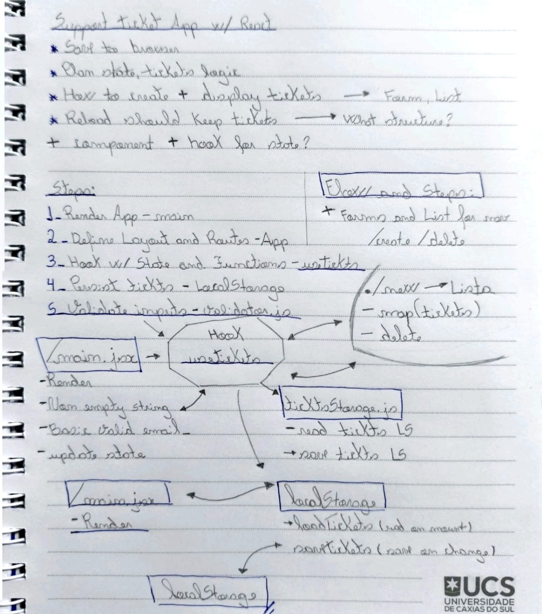

<div align="center">

# Support Tickets

Frontend application developed with **React** for managing support tickets.

Repository:  
https://github.com/brenoo-luiz/ticket-manager

</div>

---

## Introduction

This project consists of a frontend application developed with **React**, with the objective of implementing a simple support ticket management system.

The application allows users to:

- Create new tickets through a form
- View all created tickets
- Delete tickets individually
- Clear all stored tickets
- Navigate between pages using routing

Even though this is a simple project, the intention was not only to make it work, but to structure it in an organized and scalable way from the beginning.

Before starting the implementation, I reflected on some important architectural decisions:

- Where should the state live?
- How can I avoid mixing business logic with the interface?
- How can I keep tickets even after refreshing the page?
- How can I structure the project in a modular and scalable way?

To organize these ideas, I created a sketch before starting the implementation.

---

## Thought Process

Below is the initial sketch used to define the application architecture:

<p align="center">
  
</p>

In this planning phase, I defined:

- Separation between visual components and business logic
- A custom hook to centralize state management
- A service layer responsible for persistence
- Validation logic isolated from the form component
- A clear flow between creation → state update → persistence → listing

After this initial mapping, the implementation became more structured and maintainable.

The architecture was organized in a modular way, separating responsibilities into **pages, components, hooks, services, and utils**.

---

## Implemented Features

### 1. Ticket Creation

Form containing:

- First Name
- Last Name
- Company
- E-mail
- Description

On submission:

- The data is validated
- A `ticket` object is created with a unique `id`
- A `createdAt` timestamp is generated automatically
- The ticket is added to the global state
- The ticket is saved in LocalStorage
- A success message is displayed

Validation was separated from the component to keep the code clean and organized.

---

### 2. Ticket Listing

- Displays all created tickets
- Data organized in table format
- Automatic update when tickets are added or removed
- Individual ticket deletion (Delete button)
- “Clear all” button to remove all tickets
- Persistence maintained even after page refresh

The table displays:

- First Name
- Last Name
- Company
- E-mail
- Description
- Created (date and time)
- Actions (Delete)

---

### 3. Navigation

Page navigation implemented using **React Router DOM**.

Defined routes:

- `/` → Redirects to `/new`
- `/new` → Ticket creation
- `/tickets` → Ticket list

Routing is centralized in `src/routes/index.jsx`.

---

## Technologies Used

- React 19
- Vite 7
- React Router DOM 7
- JavaScript (ES Modules)
- ESLint
- CSS

---

## Project Architecture

Structured following separation of concerns:

```
📦 ticket-manager/
├── docs/
│   └── rabisco.jpeg
├── public/
│   └── vite.svg
├── src/
│   ├── components/
│   │   ├── Layout/
│   │   │   └── Layout.jsx
│   │   ├── Navbar/
│   │   │   └── Navbar.jsx
│   │   ├── TicketForm/
│   │   │   └── TicketForm.jsx
│   │   └── TicketTable/
│   │       └── TicketTable.jsx
│   ├── hooks/
│   │   └── useTickets.js
│   ├── pages/
│   │   ├── NewTicket/
│   │   │   └── NewTicket.page.jsx
│   │   └── TicketList/
│   │       └── TicketList.page.jsx
│   ├── routes/
│   │   └── index.jsx
│   ├── services/
│   │   └── ticketsStorage.js
│   ├── styles/
│   │   └── global.css
│   ├── utils/
│   │   └── validators.js
│   ├── App.jsx
│   └── main.jsx
├── .gitignore
├── eslint.config.js
├── index.html
├── package.json
├── package-lock.json
├── vite.config.js
└── README.md
```

---

## Technical Decisions

### Routing

- `/` → Redirects to `/new`
- `/new` → Ticket creation
- `/tickets` → Ticket list

Routing is centralized in `src/routes/index.jsx`.

---

### Custom Hook — useTickets

The ticket management logic was isolated into a custom hook responsible for:

- Adding new tickets
- Removing individual tickets
- Clearing all tickets
- Retrieving the list
- Integrating with the storage service

This keeps components focused only on the interface.

---

### Persistence

The `ticketsStorage.js` service abstracts access to LocalStorage:

- Saves tickets
- Retrieves stored tickets
- Clears stored tickets

Data remains available even after refreshing the page.

If it becomes necessary to replace LocalStorage with an API in the future, only this layer will need to be modified.

---

### Validation

Validation rules are isolated in:

```
src/utils/validators.js
```

Keeping the form component clean and organized.

---

## Installation and Usage

### 1. Clone the repository

```bash
git clone https://github.com/brenoo-luiz/ticket-manager
```

### 2. Navigate to the project folder

```bash
cd ticket-manager
```

### 3. Install dependencies

```bash
npm install
```

### 4. Start the development server

```bash
npm run dev
```

The development server will start at:

```
http://localhost:5173
```

Open this address in your browser.

---

## Usage Flow

### Creating a new ticket

1. Access `/new`
2. Fill in the fields:
   - First Name
   - Last Name
   - Company
   - E-mail
   - Description
3. Click **Submit**

- If any field is empty, submission will be blocked.
- If everything is valid, the ticket will be created and persisted.

---

### Viewing tickets

1. Access `/tickets`
2. The table will display:
   - First Name
   - Last Name
   - Company
   - E-mail
   - Description
   - Created
   - Delete action

All tickets are stored in the browser’s LocalStorage.
